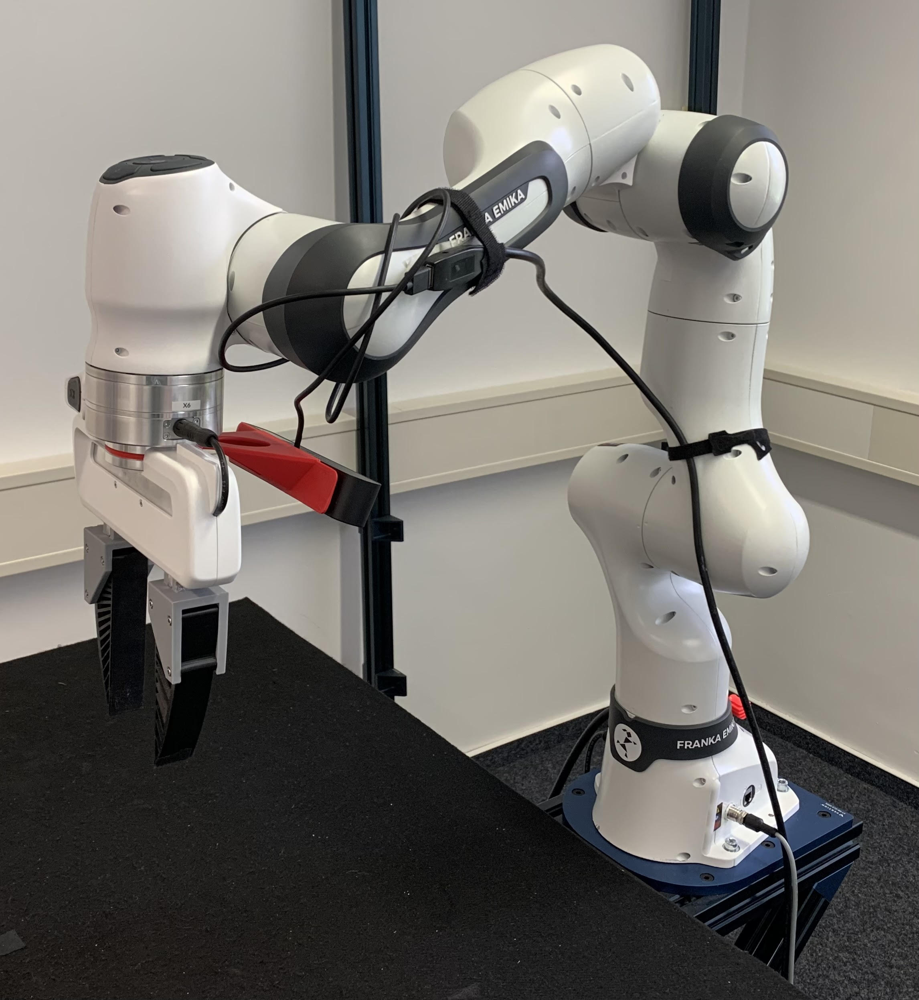

# Impedance Controller
Maintainer: Yuchen Xia

Main Supervisor: Jiayun Li

## Introduction 
With this Repo, you can control **Franka Emika robot** in Lab (Version: **Panda**, see below) in **Joint Space** or in **Task Space** with Null Space Damping.

1. Refering build section fo setup the package:
    - [Prerequisites](#prerequisites)
    - [Build](#build)
    - [Run](#run)

2. Following the brief introduction for different impedance controller paramerters in the Repo:
    - [Parameters](#parameters)
    - [Joint Space](#joint-space-impedance-controller)
    - [Task Space](#task-space-impedance-controller-with-null-space-damping)

<p align="center">

</p>


## Prerequisites
1. __Ubuntu and ROS__

   This package is intended to be used with **Ubuntu 22.04** and **ROS Humble**.

2. __Dependencies__

   First you need to install the following dependencies:
   <!-- * [libfranka](https://github.com/frankaemika/libfranka) -->
   * [franka_ros2](https://github.com/frankaemika/franka_ros2)

     ( The `franka_ros2` repo contains a ROS 2 integration of `libfranka`. See the [Franka Control Interface (FCI) documentation](https://frankaemika.github.io/docs/franka_ros2.html) for more information about franka_ros2. )

3. __Communication with Real Robot Hardware__

   -Open the browser and navigate to `https://192.168.2.55/desk/`.

   -Open fail-safe locking system.

   -Activate FCI.

   -Operations should be in `Execution` Mode.

   -Ensure the indicator light shows **green**.


## Build
Create a ROS 2 workspace:

```
mkdir -p ~/franka_ros2_ws/src
```


If already done so, clone repo `Force_Control` to your workspace and build packages:

```
cd franka_ros2_ws/src
git clone https://...
cd ..

colcon build force_control
# or compile a specific package
colcon build --packages-select force_control 

source install/setup.bash
```

## Run
**⚠️Warning⚠️**:

First time running the controller or after changing a parameter in the config file, **the E-Stop button should be kept close at hand!!!**

Run the launch file:
```
ros2 launch force_control impedance_controller.launch.py robot_ip:=192.168.2.55
```

## Parameters

You can change the parameters in `./config/controller.yaml`.

1. **Controller Type**: 
        
   `controller`: `task_space_controller` or `joint_space_controller`

    
2. **Joint Space Controller**:

   `k_gains_js`: Used to define the spring-like behavior of the robot's end-effector.

   `d_gains_js`: Used to define the damping behavior in the impedance control.
    

3. **Task Space Controller**:

   `Lambda_d_ts`: **Desired Inertia Matrix**
                
   Represents the desired task space inertia for the robot's end-effector.

   `K_d_ts`: **Desired Stiffness Matrix**

   Determines how the robot should resist deviations from a desired position in the task space.
 
   `D_d_ts`: **Desired Damping Matrix**
            
   Specifies the desired damping characteristics in the task space. It defines how the system should dissipate energy to counteract the velocity of the end-effector, providing stability and reducing oscillations.

   `K_D_ts`: **Null Space Damping Gain**
            
   Used to apply damping in the null space of the robot's configuration. This parameter helps stabilize the redundant degrees of freedom (DOFs), ensuring smooth and stable motion.


## Robot Data Record wtih Given Trajectory (Joint Position, Velocity, Acceleration)

Record the robot state data in the folder `./data_log/data_log.dat`. The description of the data rows is in `./data_log/data_description.txt`.
Input trajectory in the folder...

Run the launch file:
```
ros2 launch force_control trajectory_datarecord_controller.launch.py robot_ip:=192.168.2.55
```

